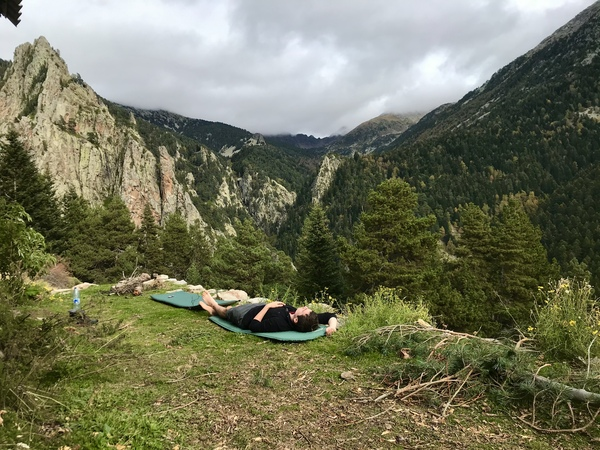

   .. loicvh documentation master file, created by
   sphinx-quickstart on Thu Feb 27 18:08:50 2020.
   You can adapt this file completely to your liking, but it should at least
   contain the root `toctree` directive.

.. toctree:: :hidden:
   :maxdepth: 1
      
      About <self>
      Research <research.rst>
      Teaching <teaching.rst>
      Contact <contact.rst>
      CV <cv.rst>
      Misc <misc.rst>
      Blog <blog.rst>

About
_____

Hello stranger! I am Loïc and I conducted a PhD in applied mathematics (titled *nonconvex and nonsmooth economic dispatch*) under the supervision of `Pierre-Antoine Absil <https://sites.uclouvain.be/absil/>`_ and `Anthony Papavasiliou <https://perso.uclouvain.be/anthony.papavasiliou/public_html/>`_ at UCLouvain (Louvain-la-Neuve, Belgium) from 2018 to 2022.

I no longer work in academia, but I am keeping these pages online; this might serve some day...

