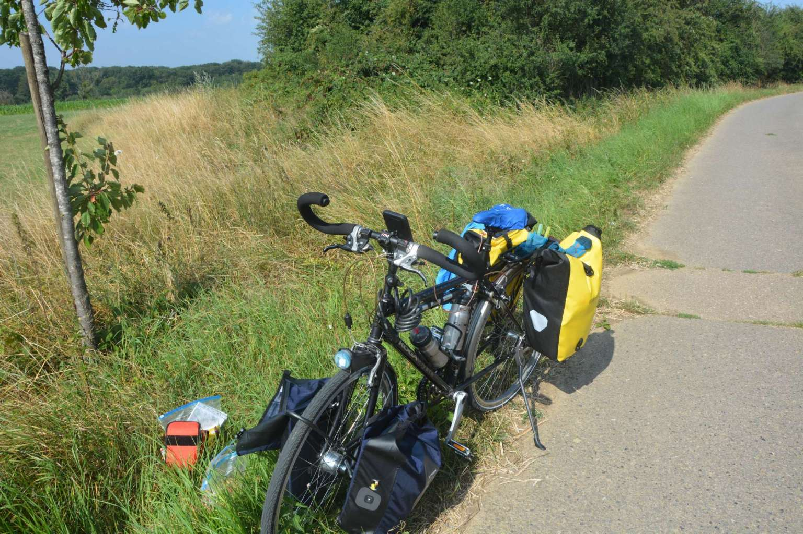
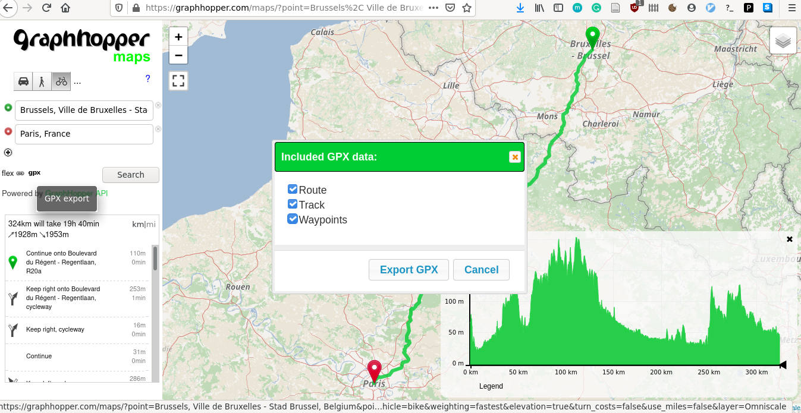
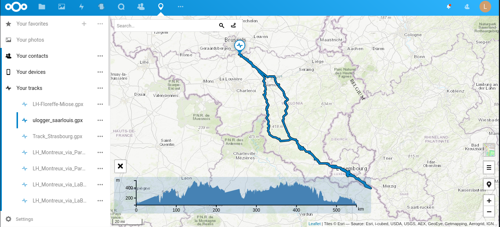

Planing a bike trip
===================

I do enjoy riding my bike for some long or semi-long rides. It raises the question about planing the trip without having to buy a brand new GPS and/or give all my data to some *probably-not-so-ethic* firms.

  My -- probably too heavy -- bike, somewhere in the Ardennes.

In this post, I am going to explain how to use GPS guiding and tracking at no cost and without sharing your precious data. You'll simply need a smartphone on android.

i) The app
----------

I *highly* recommand the GPS app `OSMAnd <https://osmand.net/>`_, it is opensource, has *lots* of features, allows you to download easily the map for offline use -- which save your battery while on your bike --, does *not* spy on you, ...

The app cost 15 bukes -- and is worth every penny -- *but* you can have it freely on `F-Droid <https://f-droid.org/en/packages/net.osmand.plus/>`_ [1]_. I'd suggest you to get it for free but donate to the project after.

Great! We have our GPS app, and can use our phone as GPS. It is possible to simply enter our destination on this app but this is not ideal. First, it makes planing quite difficult. Second, OSMAnd has a strange definition of "biking ways", and I often found myself to push my bike. And finally, the service is slow for too long queries, e.g., several dozen of kms. Fortunately, one of the many features of OSMAnd is the ability to load .gpx traces, which we'll be creating with another website.

ii) The route planing website
-----------------------------

`Graphhopper <https://www.graphhopper.com/>`_ is another awesome project. It allows you to plan your trip easily, add some waypoints and download the gps trace as well as the guiding route.

  Look at this nice interface! It's so easy to create, vizualize and download your route!

iii) The actual logger
----------------------

Flash news, **you are not going to follow exactly the route you planned**, and it can be nice to have the actual path you made. There exists *tons* of GPS trackers but most of them will be so happy to access your location that they may keep it -- and probably sell it. Of course, you can now search on F-Droid -- which you obviously have already downloaded, right? -- an app respecting your privacy and *bingo*, you find `μlogger <https://f-droid.org/en/packages/net.fabiszewski.ulogger/>`_. This app does everything you ask for and nothing more. It tracks your location without draining your battery, allows you to select the frequency and minimum distance. If you want to synchronize the data with **your** server, you can, or if you rather keep the data and upload it manually... Guess what? You also can!

iv) Sharing your awesome trip
-----------------------------

Last but not least, you probably want to visualize μlogger's track. You can obviously load it to OSMAnd or openstreetmap, but it makes the sharing a bit tedious. I personally used the `maps <https://apps.nextcloud.com/apps/maps>`_ application from my self-hosted `nextcloud instance <https://nextcloud.com/>`_ to have the exact path I rode!

  And here is the actual trip I made... Notice that the track elevation around km 0 and 230 looks strange... I simply forgot to launch µlogger and the app used linear interpolation.

v) Conclusion
-------------

It may seem a bit tedious to avoid the GAFAM and their business models but, for this specific case, it is not so difficult to have a cheap and effective solution. By the way, I used only once google maps during my whole trip, because *I thought* that it will be easier to reach a camping with maps than with OSMAnd. The journey to the camping was only three kms and maps brought me to such horrible paths that my powerbank fell off my bike, despite being very well attached. This only happened that time...

All the apps I mentioned here can be used on a google-free smartphone, e.g., running `Lineage OS <https://lineageos.org/>`_ with `microG <https://microg.org/>`_. You don't *need* google, folks.

.. [1] "F-Droid is an installable catalogue of FOSS (Free and Open Source Software) applications for the Android platform."

.. rubric:: Posted on 2020-08-23

