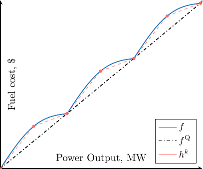

Research
========

Research Interests
~~~~~~~~~~~~~~~~~~

- Modeling and Simulation

Preprint
~~~~~~~~

- L. Van Hoorebeeck, P.-.A Absil and A. Papavasiliou,
  "**Global Solution of Economic Dispatch with Valve Point Effects and Transmission Constraints**,"
  2020 Power Systems Computation Conference (PSCC), Porto, Portugal, 2020. (Submitted,
  :download:`preprint <data/PSCC_2020.pdf>`,
  `code <https://gitlab.com/Loicvh/apla>`_)

Refereed conference papers
~~~~~~~~~~~~~~~~~~~~~~~~~~

- (2019) L. Van Hoorebeeck, P.-.A Absil and A. Papavasiliou,
  "**MILP-Based Algorithm for the Global Solution of Dynamic Economic Dispatch Problems with Valve-Point Effects**,"
  2019 IEEE Power & Energy Society General Meeting (PESGM), Atlanta, GA, USA, 2019, pp. 1-5. (:download:`preprint <data/PES_2019.pdf>`,
  `IEEE Xplore <https://ieeexplore.ieee.org/document/8973631>`_)

- (2019)  L. Van Hoorebeeck, J. Cavillot, H. Bui-Van, F. Glineur, C. Craeye and E. de Lera Acedo,
  "**Near-field calibration of SKA-Low stations using unmanned aerial vehicles**,"
  13th European Conference on Antennas and Propagation (EuCAP), Krakow, Poland, 2019, pp. 1-5. (:download:`preprint <data/PES_2019.pdf>`,
  `IEEE Xplore <https://ieeexplore.ieee.org/document/8739380>`__)

Thesis
~~~~~~

- "**Calibration of the SKA-low antenna array using drones**", Master Thesis, June 2018.
  (Advisers: C. Craeye and F. Glineur, `pdf <https://dial.uclouvain.be/memoire/ucl/fr/object/thesis%3A14813>`_)

Research Problems
~~~~~~~~~~~~~~~~~

Economic Dispatch
-----------------

I am currently interested in the **economic dispatch problem (EDP)**, this problem consists in the optimal allocation of the committed [#f1]_ generating units to meet the system load at lower cost. The objective function is the sum of each unit :math:`g \in G` fuel cost at each time step :math:`t \in T`. Mathematically it reads, 

.. math:: 
   :label: obj

    \min \sum_{t \in T} \sum_{g \in G} f_g (p_{gt}),

of course I need to specify the cost functions. In my case, I want to model a physical effect, *the valve point loading effect* (VPE) which naturally occurs in large gaz power plant such as combined cycle gas turbines (CCGT): when a turbine is loaded *at* a valve point, that is just before the next valve is opened, the production is optimal, but when a turbine is loaded *off* a valve point, that is just after the opening of the valve, then the throttling losses increase. This sudden changes in the objective raises computational challenges. Here we model this effect with the following objective function

.. math::
   :label: obj_VPE

   f_g (p_{gt}) = \underbrace{A_g p_{gt}^2 + B_g p_{gt} + C_g}_{f^{\text{Q}}_g ({gt})} + \underbrace{D_g \left | \sin E_g (p_{gt} - p^{\min}_{gt}) \right | }_{f^{\text{S}}_g ({gt})}  .

The following plot (in blue) gives an idea of how this function looks like.

.. figure:: data/images/pg_0001.png
    :align: center  
    :alt: Illustration of the VPE.

    Figure 1: A term of the objective function for a given generator :math:`g` at time :math:`t`.

This function is the sum of a smooth quadratic part (:math:`f^{\text{Q}}`) and a nonsmooth and nonconvex rectified sine (:math:`f^{\text{S}}`), and the devil lies in the later. Since the function is nonconvex, it is really difficult to prove the optimality of a point that we think is optimal and because of the nonsmoothness, we cannot use the vast amount of methods using first and second order information. Basically, the best algorithms and convergence theorems in optimization start with the sentence: 

.. pull-quote::
   Given a smooth convex function :math:`f`...

Here, we will need some tricks to tackle this problem. This will be explained soon, but first let's look at the constraints.

Feasible Set
------------

The set of constraints can be split into two categories: *operational constraints*, which consists in making sure that any solution is physically possible. It includes power ranges, ramp rates, network constraints and so on. The second class of constraints are the *economic constraints* which enforce the fact that we meet the demand and the reserve at each timestep. 

Most of these constraints are boring linear ones, which means that they can easily be tackled. Considering the non boring constraints, we can first talk about the network constraints, some models of the network constraints consider are nonconvex and a lot of work is currently done to integrate these nonconvex model or other semidefinite programming (SDP) and second-order cone (SOC) relaxations. The second non boring constraint I can think of is the economic constraint accounting for the losses. This is often modelled as a quadratic surface, or *quadric*, which is also nonconvex.

Great, now we have a nonconvex nonsmooth objective *and* a nonconvex feasible set... How do we deal with such a problem?

Algorithm
---------

How do we deal with such a problem? There are two different strategies: i) we target a fast and good solution with a heuristic and ii) we try to have some guarantees with respect to the finale solution. Here, we want to focus on the second case and therefore obtain a good solution along with a lower bound; we want to sandwich the optimal solution. The key here is to use a *relaxation* defined as follows.

.. pull-quote::
    A *relaxation* of a given (minimization) optimization problem is another optimization problem of a new function on a new feasible set such that the relaxed objective if an underapproximation of the original objective and the relaxed set contains the original feasible set.

Here with a slight abuse of language, I will consider separately the increasing of the feasible set (which I will call *relaxation*) and the underapproximation of the objective.

.. rubric:: Footnotes

.. [#f1] A *committed* generator is simply a generator which has been scheduled to produce power. Hence, we expect every generator to produce. This makes the EDP much simpler than its cousin, the *unit commitment*, which has to take every combination of committed unit into account.
